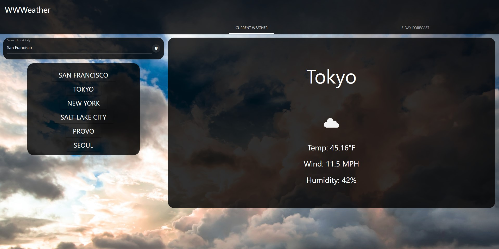
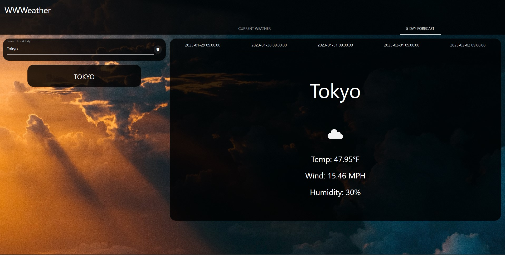

# WWWeather

WWWeather is a weather application that allows users to search for the current weather and five-day forecast of a specific city using data from OpenWeather API. The user can also view their search history by clicking on the previously searched cities that appear as the user submits searches.

[Check the weather for your favorite city at this link!](https://navidliwa.github.io/wwweather/)

## Features

- Search for current weather and a 5 day forecast for any city
- Display current weather conditions such as temperature, humidity, and wind speed
- Saves a list of previous searches that can be clicked on to
- Background is randomly generated on each page load using Unsplash
- Background updates to match each searched city and cities from the search history

## Usage

Use the search bar on the left hand side to type in your desired city and then click the search button to bring up weather information. You can use the "Current Weather" and "5 Day Forecast" tabs to navigate between current and forecasted conditions. After each search, your searched city will be added to your search history right below the search bar. You can use this search history to go back to any previously searched city.

## Page Appearance

Here is what the site looks like on the current weather and 5 day forecast tabs in that respective order:

## Built With

- HTML
- CSS
- JavaScript
- JQuery
- Materialize
- OpenWeather API

## License

This project is licensed under the MIT License